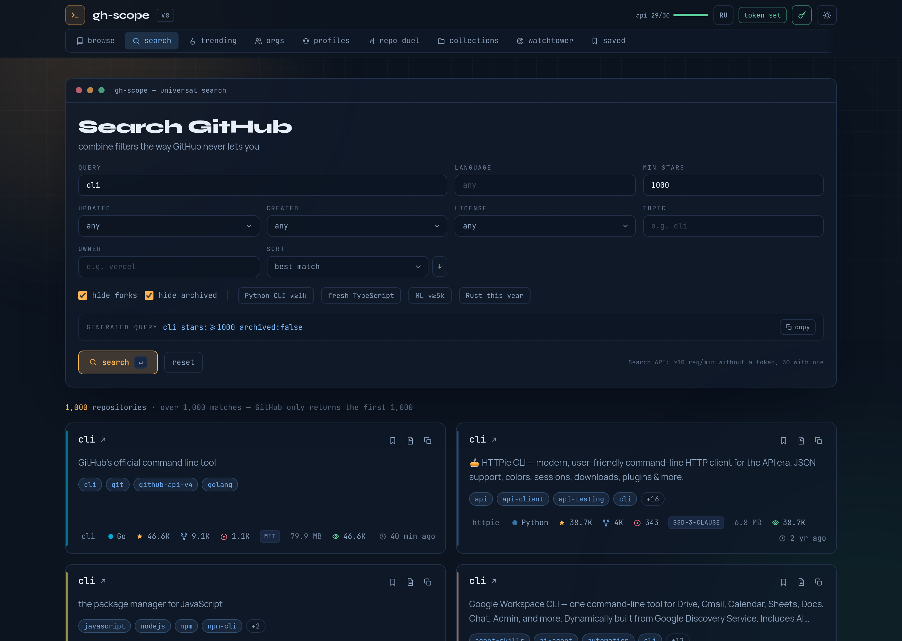
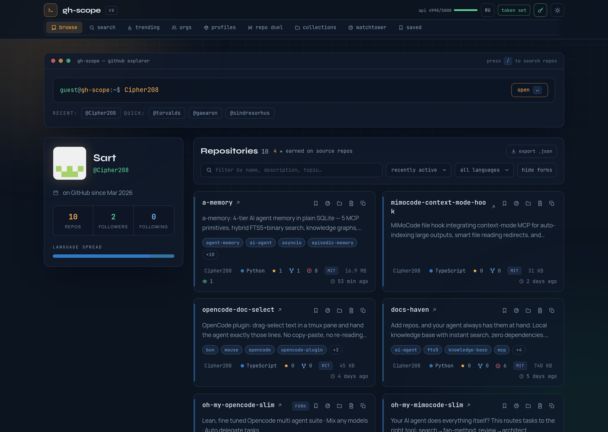

<div align="center">

# gh-scope

**A GitHub explorer that lets you combine filters the way GitHub never does.**

Profiles, orgs, repo duels, collections, a release radar and trending — in one
static page. No backend, no accounts, no telemetry.

[](https://github.com/Cipher208/gh-scope/actions/workflows/ci.yml)
[](LICENSE)
[](#what-leaves-your-browser)
[](#stack)

**[Live demo →](https://cipher208.github.io/gh-scope/)**

</div>

---

## Why this exists

I use GitHub search every day, and it keeps refusing to do the obvious thing.
You can filter by language *or* by stars *or* by topic — and the moment you want
all three at once, you are writing qualifier syntax by hand and re-reading the
documentation to remember whether it is `stars:>1000` or `stars:>=1000`.

So I built the search box I actually wanted: tick the filters, watch the query
build itself, and see the result. Then I kept going, because the same annoyance
shows up in other places — you cannot compare two profiles side by side, you
cannot watch a repo for the moment it cuts a release, and you cannot keep a
shortlist without starring things you will never look at again.

**gh-scope is what I reach for instead of github.com.** It is not a replacement —
everything it shows comes from the GitHub API, and clicking through lands you
back on GitHub. It is a better window onto the same data.

## Screenshots

<div align="center">



*Combining language, stars, dates, license, topic and owner — with the query
assembled live underneath. No qualifier syntax to remember.*



*Any profile becomes a browsable showcase: filters, sorting, a language
breakdown and JSON export.*

</div>

## Features

| | |
| --- | --- |
| **Search** | Combine language, stars, dates, license, topic, owner, sort order and direction. Forked and archived repos are hidden by default. The final API query is shown as you build it. |
| **Browse** | Any profile as a showcase: filters, sorting, a language breakdown and JSON export. |
| **Orgs** | A whole organisation's fleet — `/orgs/{org}/repos` with sorting and languages. |
| **Profiles duel** | Two logins side by side, scored across six metrics. |
| **Repo duel** | Two repositories compared card by card. |
| **Collections** | Your own AWESOME-style lists, saved locally. |
| **Watchtower** | Watch repositories and see what changed since you last looked. |
| **Releases** | A radar of fresh releases from the repos you watch. |
| **Trending** | Repositories growing stars fastest — not GitHub's own trending page. |
| **README viewer** | Markdown rendering with a machine translation into Russian, plus one-click jumps to DeepWiki, GitDiagram and GitMCP. |

Plus: dark and light themes, an interface in English and Russian, bookmarks,
keyboard shortcuts, and hash routing so every view is a shareable link.

## Quick start

```bash
npm install
npm run dev        # http://localhost:5173

npm run build      # production build into dist/
npm run typecheck  # tsc --noEmit
```

Requires Node 22 or newer.

## Deploying

The build is a folder of static files. Host it anywhere.

### GitHub Pages

The workflow in [`.github/workflows/pages.yml`](.github/workflows/pages.yml)
builds and publishes `dist/` on every push to `main`. A repository admin needs
to select **Settings → Pages → Source: GitHub Actions** once.

`base` is set to `./` in `vite.config.js`, so the same build works under a
project subdirectory (`user.github.io/gh-scope/`) and at a domain root.
Navigation is hash-based, so deep links do not 404 on static hosting.

### Cloudflare Pages, Vercel, Netlify

Build command `npm run build`, output directory `dist`. Nothing else to configure.

## Settings

The key button in the header opens settings. Both fields are stored **only in
this browser's `localStorage`** and go nowhere except the service you named
yourself. That is not a compromise — it is what static hosting means: there is
no server here to hold your key, and anything compiled into the bundle is
public by definition.

**GitHub token (optional).** Without one the API allows 60 requests per hour per
IP and hides private repositories. A classic token with **no scopes at all** is
enough to raise the limit to 5000/hour. The `repo` scope is needed only if you
want private repositories to appear. The current budget is shown in the header.

**Translation endpoint (optional).** The built-in transport calls Google's public
`translate_a/single?client=gtx` — an undocumented endpoint used by the Google
Translate widget, which Google may close at any time. If you supply your own
LibreTranslate-compatible URL (`POST /translate` → `translatedText`), it is
tried first and the public one stays as a fallback.

## What leaves your browser

There is no backend, so the list is short — but it is worth stating plainly:

| What | Where | When |
| --- | --- | --- |
| Your GitHub token | `api.github.com` | on every request, if you set one |
| README text | your translation endpoint, or Google | **only** when you click translate |
| Logins and search filters | `api.github.com` | when you load a profile or search |

Two consequences worth knowing before you paste a token:

- **The token is only as safe as the domain it is entered on.** Do not run this
  from a compromised or look-alike host, and do not leave it open in browser
  extensions you do not trust.
- **The translate button sends the README you are reading to a third party.**
  If you are viewing a private repository, that repository's README leaves your
  browser. Translate only what you are comfortable showing a service, or point
  the setting at an endpoint you control.

Bookmarks, theme, language and collections never leave the browser at all.

## Limits

Unauthenticated, the GitHub API allows 60 requests per hour per IP and about 10
searches per minute. The live budget is visible in the header. A token raises
the first number to 5000.

## Stack

- **React 18** with TypeScript, bundled by **Vite 6**
- **Tailwind CSS v4** (the Vite plugin, no config file)
- No runtime dependencies beyond React itself
- No analytics, no cookies, no server

## Contributing

Issues and pull requests are welcome — see [CONTRIBUTING.md](CONTRIBUTING.md).
By taking part you agree to the [Code of Conduct](CODE_OF_CONDUCT.md).

Found a security problem? Please do not open a public issue —
see [SECURITY.md](SECURITY.md).

## License

[MIT](LICENSE) © Sart

---

<div align="center">

gh-scope is not affiliated with, endorsed by, or connected to GitHub, Inc.
All data is fetched live from the public GitHub API.

</div>
